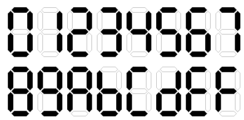
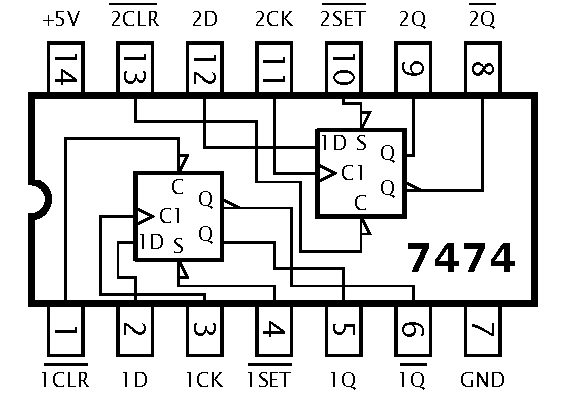
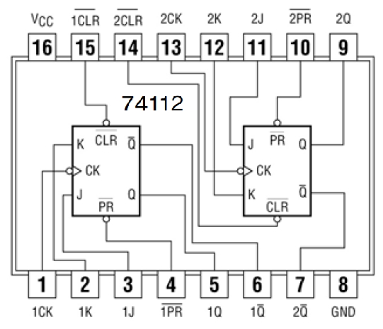

# Track B: INTEGRATED CIRCUITS

In this track, our basic building blocks are ICs and not transistors.

## Chapter 1: NAND-only logic

Logic circuits are memoryless.

* The 7400 contains four 2-input NAND gates. Study the [datasheed of the 7400](https://www.ti.com/lit/ds/symlink/sn7400.pdf).
* Print the [diagram of the 7400](https://commons.wikimedia.org/wiki/File:7400_Quad_2-input_NAND_Gates.PNG).
* From 2-input NAND gates only:
   * Build an inverter.
   * Build a 2-input AND gate.
   * Build a 2-input OR gate.
   * Build a 2-input XOR gate.
   * Build a 4-input NAND gate.
   * Build a 4-input AND gate.

* Build a 4-input 1-output logic gate that outputs 1 if and only if **2 or 3 of the inputs are 1**.
* Build a 4-input 1-output logic gate that outputs:
   * 1 if all four inputs are 1
   * 0 if exatly 1 input is 1
   * anything (=don't care=DC) otherwise

* Hint: Read about the [Karnaugh maps](https://en.wikipedia.org/wiki/Karnaugh_map).

## Chapter 2: Advanced logic

Still memoryless. But at this point we can use any logic gates.
NAND, AND, OR, NOR, Inverter, etc.

### BCD -> 7-segment (decimal)

BCD stands for binary coded decimal.

| 8 | 4 | 2 | 1 | Decimal |
|:-:|:-:|:-:|:-:|:-------:|
| 0 | 0 | 0 | 0 |  0      |
| 0 | 0 | 0 | 1 |  1      |
| 0 | 0 | 1 | 0 |  2      |
| 0 | 0 | 1 | 1 |  3      |
| 0 | 1 | 0 | 0 |  4      |
| 0 | 1 | 0 | 1 |  5      |
| 0 | 1 | 1 | 0 |  6      |
| 0 | 1 | 1 | 1 |  7      |
| 1 | 0 | 0 | 0 |  8      |
| 1 | 0 | 0 | 1 |  9      |
| 1 | 0 | 1 | 0 |  X      |
| 1 | 0 | 1 | 1 |  X      |
| 1 | 1 | 0 | 0 |  X      |
| 1 | 1 | 0 | 1 |  X      |
| 1 | 1 | 1 | 0 |  X      |
| 1 | 1 | 1 | 1 |  X      |

Build a logic circuit that:

* has 4 input bits and 7 output bits
* treats the 4 input bits as BCD
* drives a 7-segment LED display to display the value

### Hex digit to 7-segment

Extend the BCD to 7-segment logic to display

.

## Chapter 3: State (Flip-flops)

### RS latch

Build an (non-clocked) RS flip-flop from 74xx logic gates.
*  R=reset
*  S=set
*  Q=output

| S (input) | R (input) | Q (output) |
|:---------:|:---------:|:----------:|
| 1         | 0         | 1          |
| 0         | 1         | 0          |
| 0         | 0         | hold       |
| 1         | 1         | undefined  |

### Edge triggered RS flip-flop

* Build an edge triggered RS flip-flop from 74xx logic gates.

| Clock (clk) | S (input) | R (input) | Q (output) |
|:-----------:|:---------:|:---------:|:----------:|
| 🠕           | 1         | 0         | 1 (set)    |
| 🠕           | 0         | 1         | 0 (reset)  |
| 🠕           | 0         | 0         | Q (hold)   |
| 🠕           | 1         | 1         | undefined  |
| X           |           |           | hold       |

### Edge triggered D flip-flop

* Build an Edge triggered D flip-flop from 74xx logic gates.

| Clock (clk) | D (input) | Q (output) |
|:-----------:|:---------:|:----------:|
| 🠕           | 1         | 1 (set)    |
| 🠕           | 0         | 0 (reset)  |
| X           |           | hold       |

### Edge triggered JK flip-flop

* Build an Edge triggered JK flip-flop from 74xx logic gates.

| Clock (clk) | J (input) | K (input) | Q (output) |
|:-----------:|:---------:|:---------:|:----------:|
| 🠕           | 1         | 0         | 1 (set)    |
| 🠕           | 0         | 1         | 0 (reset)  |
| 🠕           | 0         | 0         | Q (hold)   |
| 🠕           | 1         | 1         | !Q (toggle)|
| X           |           |           | hold       |

## Chapter 4: Building from flip-flops

* Study the [datasheet of the 7474](https://www.ti.com/lit/ds/symlink/sn74ls74a.pdf) (D-flip-flop).
* Study the [datasheet of the 74112](ti.com/lit/ds/symlink/sn74s112a.pdf) (JK).

* Build a D flip-flop from a JK flip-flop and logic gates.
* Build a 4-bit up-down counter from JK flip-flops and logic gates.
* Build a 4-bit shift-register from D flip-flops and logic gates.

## Chapter 5: Clock

1. Wire up a 4-bit binary counter (74393) to LEDs.
2. **Manual clock.** Make it incerement on every press of a button.
3. **Transistor-based clock.** Build a clock signal generator for it from RC and transistors.
4. **555.** Build a clock signal generator for it from a 555 IC.

Links:

* [Wikipedia](https://en.wikipedia.org/wiki/555_timer_IC)
* [Datasheet](https://www.ti.com/lit/ds/slfs022i/slfs022i.pdf)
* [Tutorial](https://www.electronics-tutorials.ws/waveforms/555_timer.html)

## Chapter 6

Coming soon...
